# chainer-slack-report

This is a [Chainer](https://chainer.org/)'s
[Trainer extension](https://docs.chainer.org/en/v6.0.0/guides/extensions.html)
that reports the same contents as the commonly-used
[PrintReport](https://docs.chainer.org/en/v6.0.0/reference/generated/chainer.training.extensions.PrintReport.html) extension to Slack.

```python
from chainer_slack_report import SlackReport
...
r = SlackReport(os.environ.get("SLACK_ACCESS_TOKEN", None),
                os.environ.get("SLACK_CHANNEL_ID", None),
                ['epoch', 'main/loss', 'validation/main/loss',
                 'main/accuracy', 'validation/main/accuracy', 'elapsed_time'],
                finish_mentions="@belltailjp")
trainer.extend(r, trigger=(1, 'epoch'))
...
trainer.run()
```

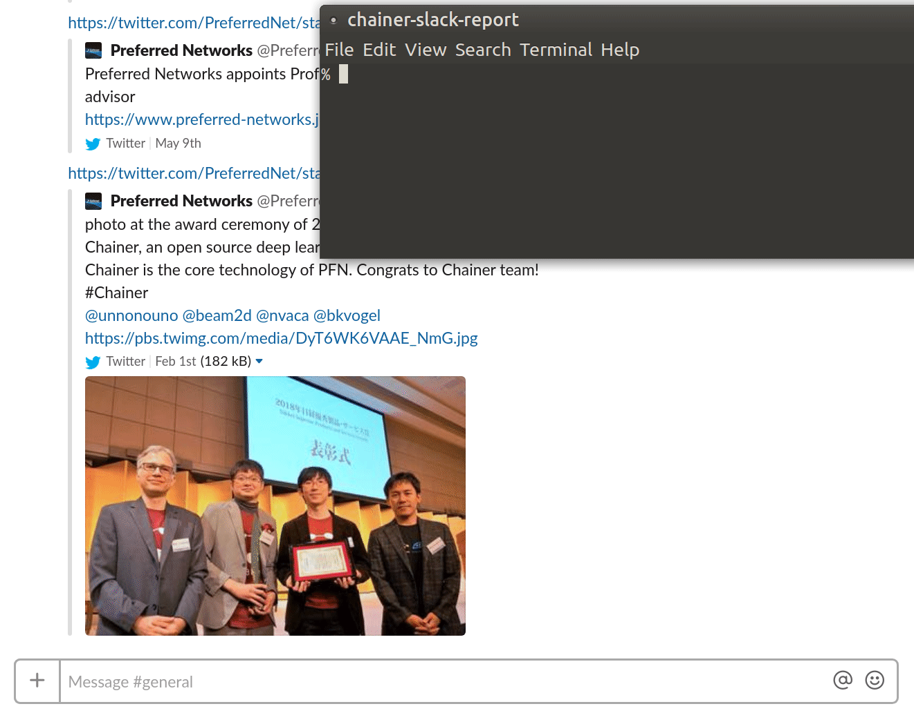

## Features

**Collision-free Slack messages**

The key feature (and difference between similar tools) of SlackReport is that
it can handle multiple training streams without collapsing Slack screen,
as shown in the above screencast.

In case you run many training processes in parallel
and each of them uses SlackReport,
the reported contents of each process are always summarized in a single message
posted by a bot, without being mixed up with other processes'.

That makes you easily track how each process is going on.


**Slack message length limit aware**

Basically Slack limits message length to be less than 4000 bytes,
but training reports can easily exceed it if you send everything.
chainer-slack-report automatically deals with this by a strategy
you specified to `len_normalizer` arguments.
- `"thin_out"`: (default) Skip a few lines uniformly, by automatically determine an optimal interval
- `"FIFO"`: Throw the oldest lines away
- `"LIFO"`: Stop new contents to be added

The first line of the content, which is table header, is always kept on top regardless of the storategy.


**Send a mention after the training finishes**

You can pass Slack user IDs that begin with '@' to the `finish_mentions`
keyword argument of the SlackReport initializer as either a str or a list,
in order to let SlackReport send a mentioning message *after*
finishing the training process,
so that you can immediately notice the training has finished.<br/>
If nothing is specified to `finish_mentions`, it just shows the final log.


**Custom report format**

You can customize what information to report to Slack by specifying
a format string to the `template` argument.

```
r = SlackReport(SLACK_ACCESS_TOKEN, SLACK_CHANNEL_ID, ...
                template="{status} {content}")
```
Named placeholders (`"{...}"`) are available, which are listed below,
and the template is processed by Python's standard string formatter (`str.format_map`).
In case an unknown placeholder is specified, it'll be kept as it is with a warning.

- `{status}`: Status string (eg. `[Completed]`, `[Training]`)
- `{hostname}`: Hostname of where the training is running on
- `{pwd}`: Current directory (full path)
- `{pwdshort}`: Current directory whose home part is replaced by `~`
- `{cmd}`: argv[0]
- `{args}`: argv[1:]
- `{elapsed}`: Elapsed time from the `SlackReport` instance is created (in sec)
- `{content}`: Main content of the reports
- `{finish_mentions}`: Slack mention (appears after the training finished)


## Install

```bash
% pip install chainer-slack-report
```

Or

```bash
% pip install git+https://github.com/belltailjp/chainer_slack_report
```


## Slack App preparation

In order to get it work, you will first need to prepare for a bot user
on your Slack workspace as explained in the following instruction.

Access to https://api.slack.com/apps.
You may be asked for signing-in to a workspace.
Then you will see a window with the "Create New App" button
which you should click.
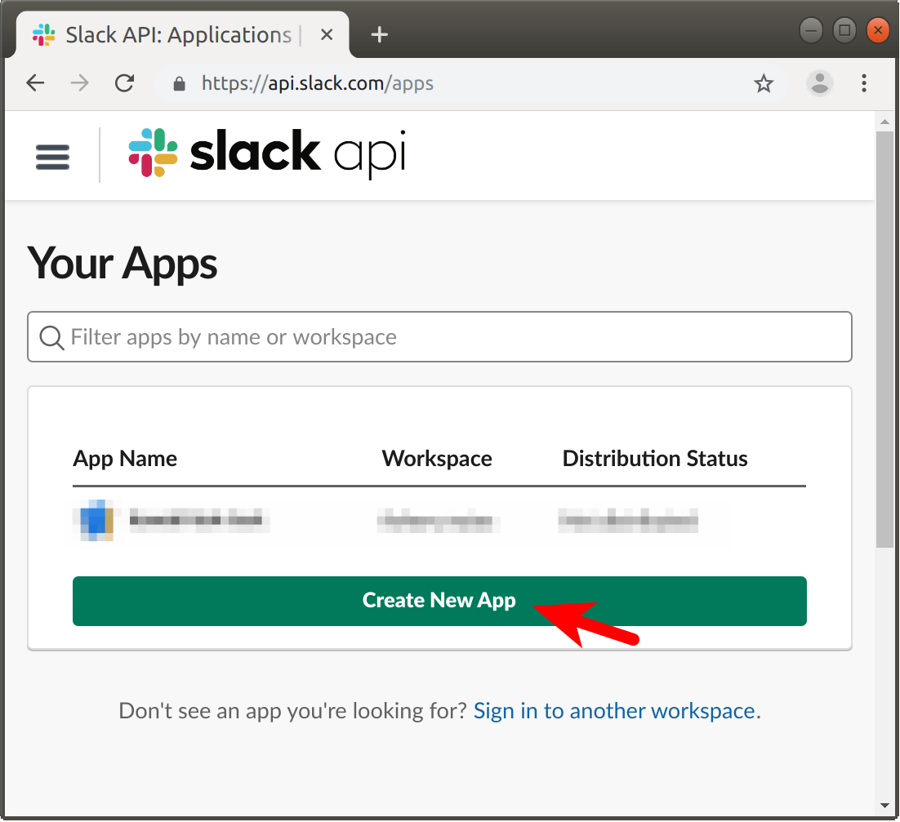


Fill the App Name field. Anything is fine.
The workspace should be the one that you'd like to send reports to.
Then click the "Create App" button.
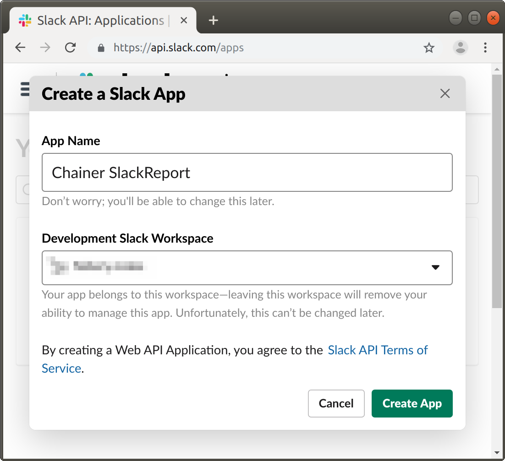


Next, you have to tell Slack that you want the app to behave as a Bot.
Scroll down the window and click the "Bots" button.
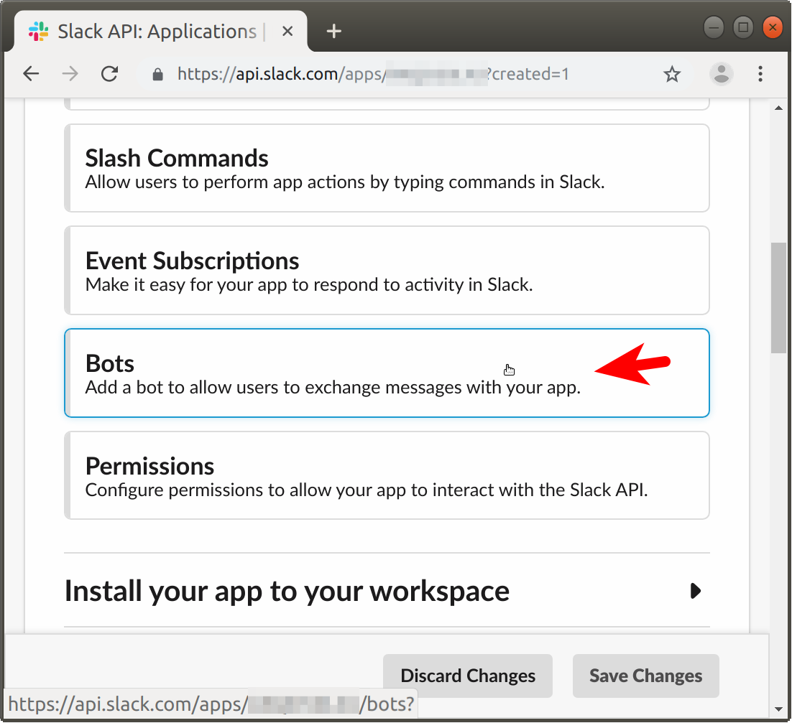


Just click the "Add a Bot User" button.
Here, Slack knows that your *app* is a *bot*.
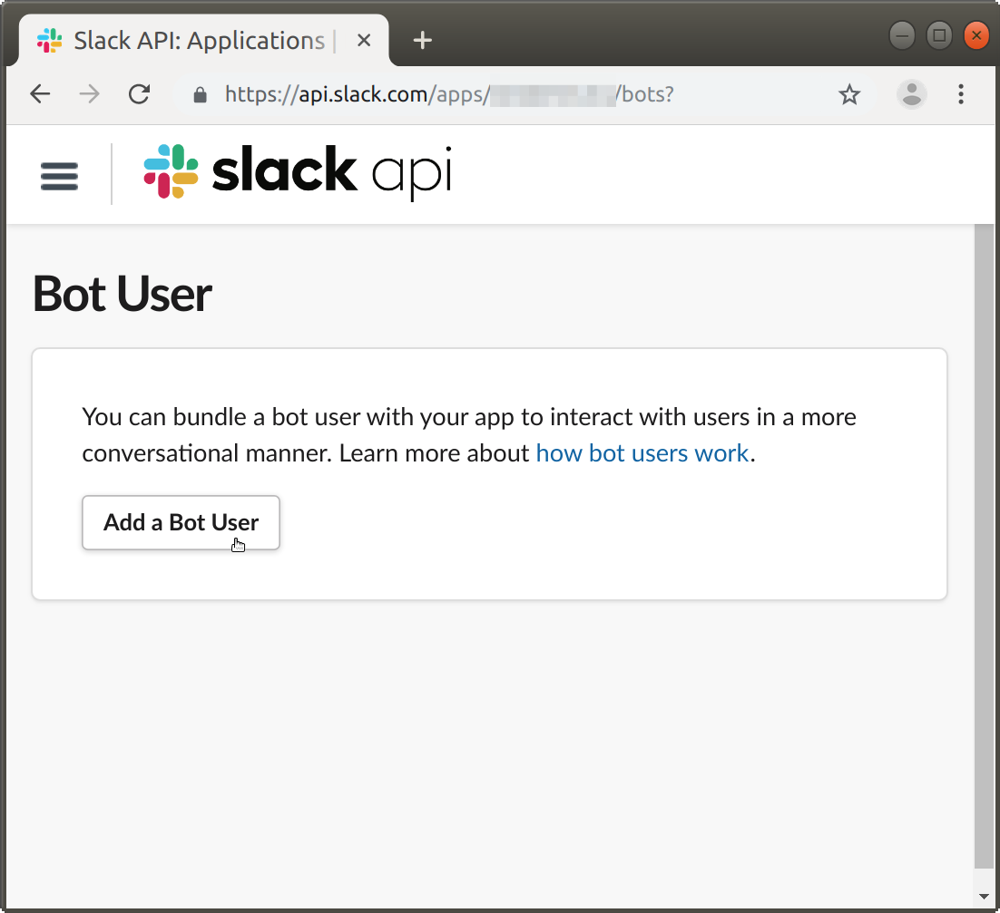


You can name arbitrary display name and user name to the bot,
except that the user name has to be valid as an identifier.
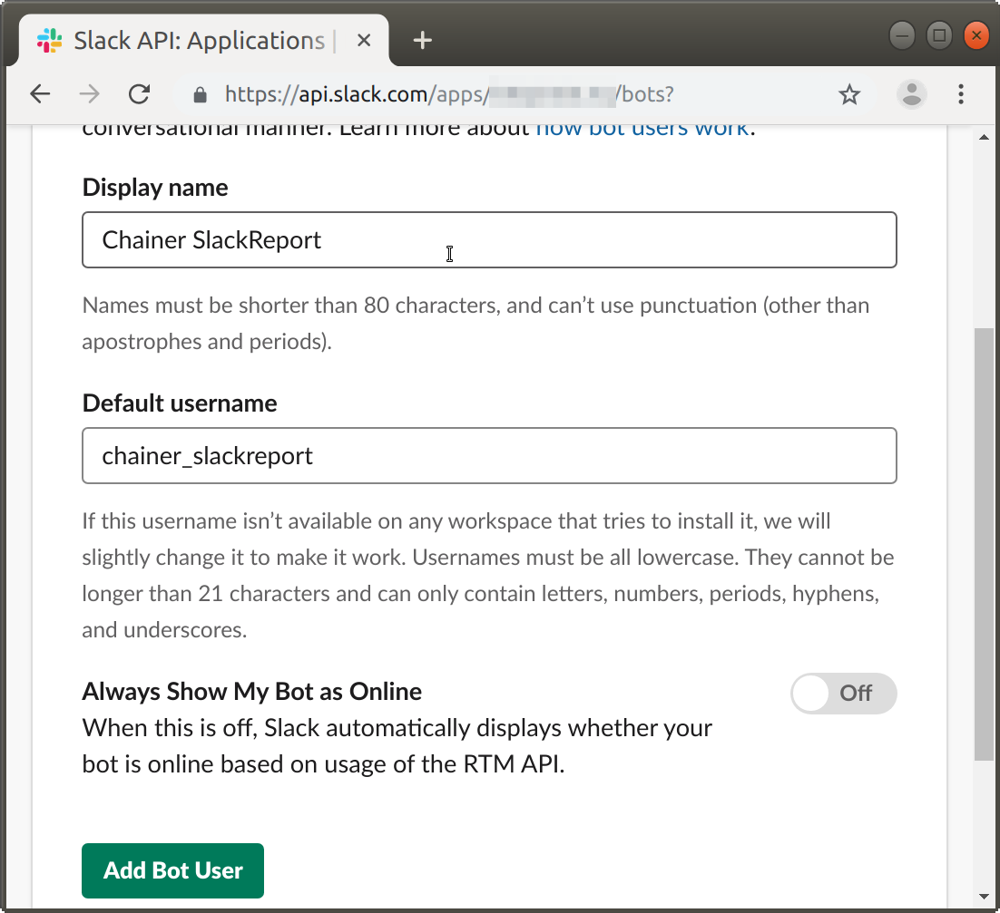


Next step is to activate the bot in your workspace
in order to get a credential to access to Slack API.
Go to "Install App" screen.


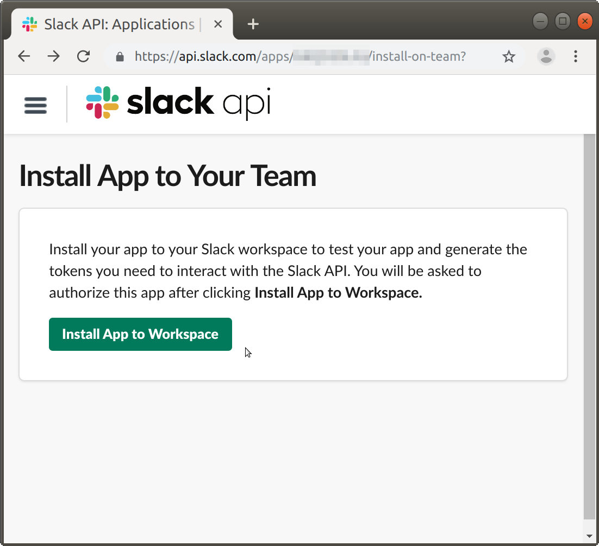


Then you'll be redirected to a screen with a bot Access Token (the bottom one).
This is what you need to pass to `SlackReport`.
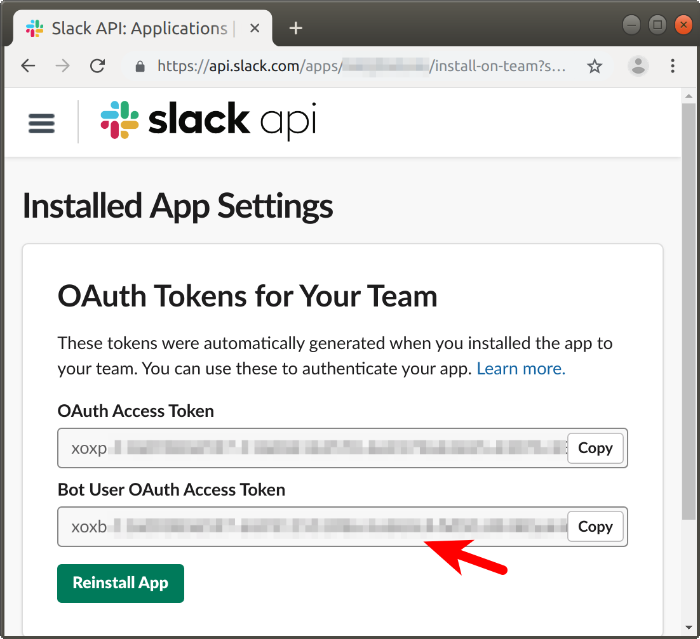


By the way, your bot doesn't have an icon yet,
so let's set it from the "Basic Information" screen.
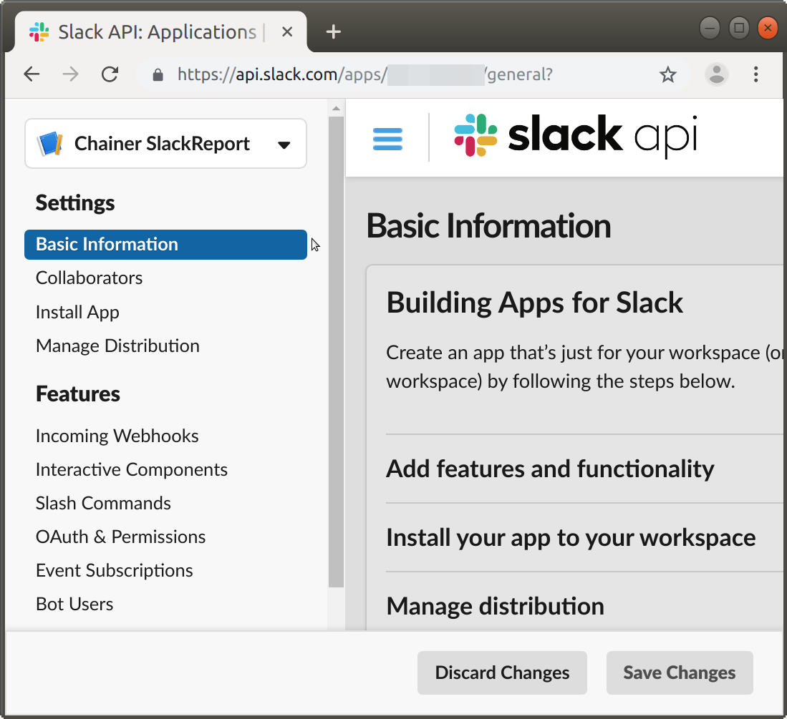
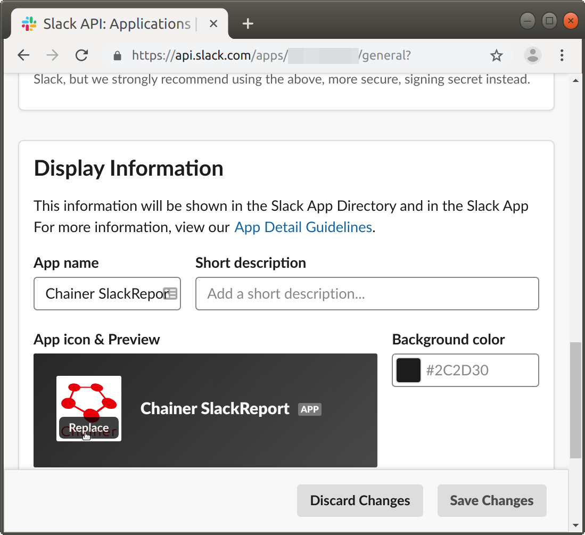


Here, your bot is ready!

You also have to identify Slack channel ID to send report to.

On the Slack screen, you can find the channel ID by looking at full URL
of the target channel.

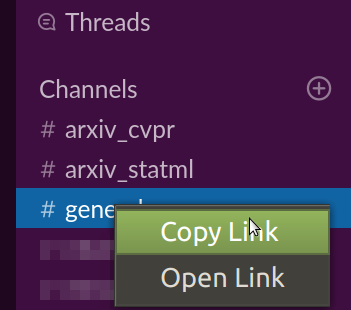

The copied URL will be like `https://WORKSPACE.slack.com/messages/CXXXXXXXX`,
whose `CXXXXXXXX` part is the channel ID.


## How it works

`SlackReport` inherits `chainer.training.extensions.PrintReport` extension,
and hooks its print function, and just sends the content to Slack
rather than stdout.

Therefore, except for `out` argument,
you can pass anything that `PrintReport` can accept to `SlackReport` too.

At the very beginning of the SlackReport object lifetime,
it "creates" a new post, and from next time it "updates" the previous post.


## License

MIT License
