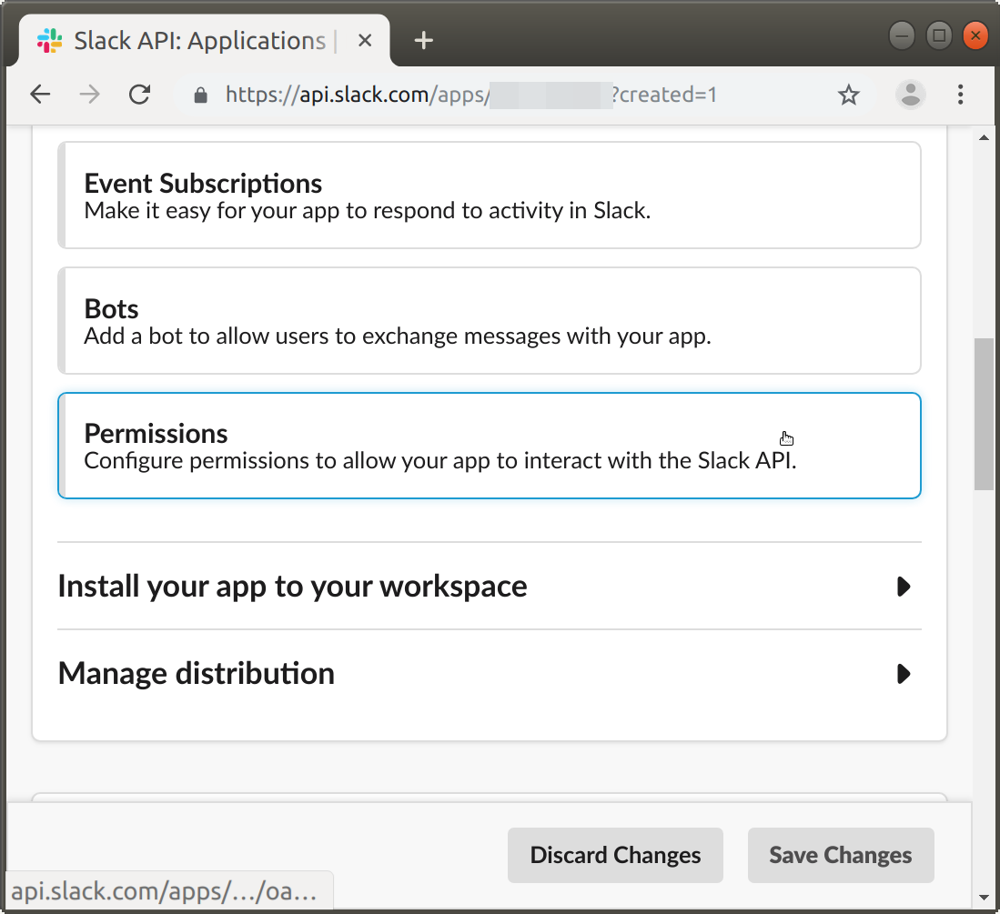
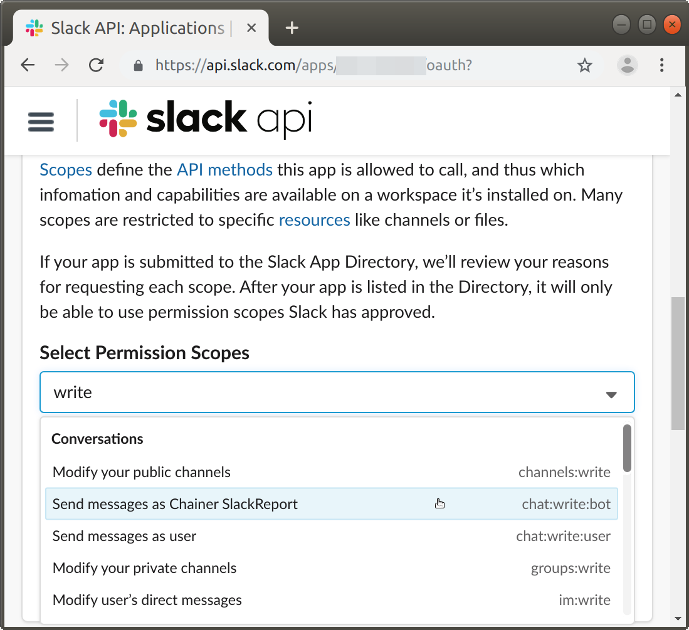
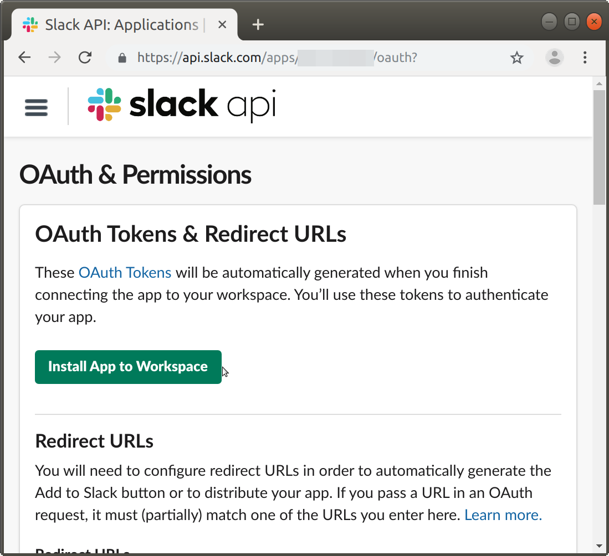
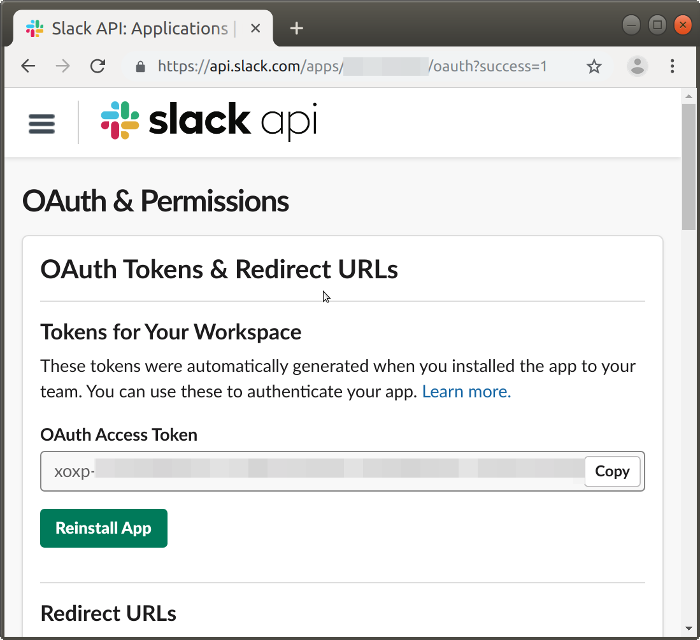
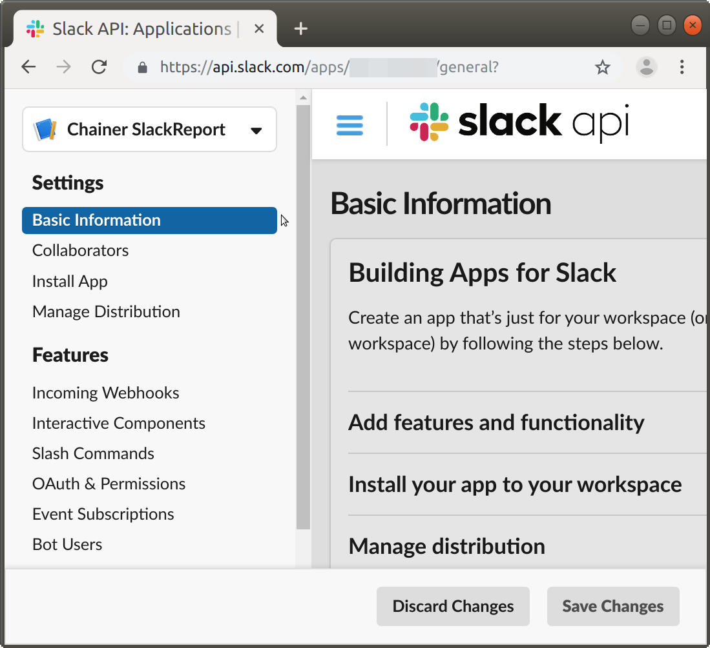
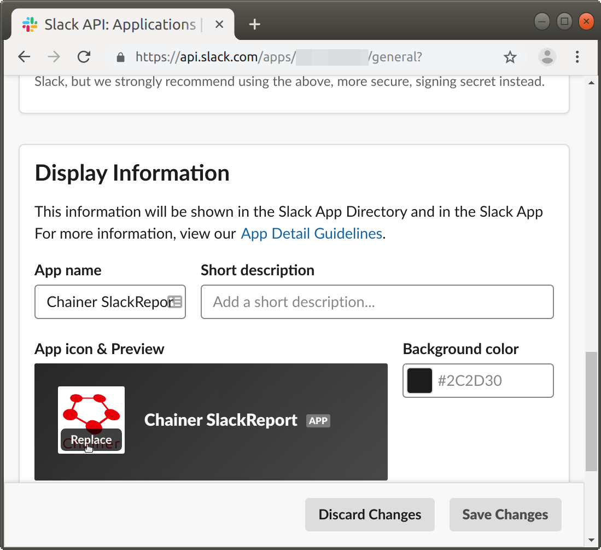
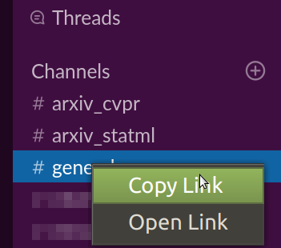

# chainer-slack-report

This is a [Chainer](https://chainer.org/)'s
[Trainer extension](https://docs.chainer.org/en/v6.0.0/guides/extensions.html)
that reports the same contents as the commonly-used
[PrintReport](https://docs.chainer.org/en/v6.0.0/reference/generated/chainer.training.extensions.PrintReport.html) extension to Slack.

```python
from chainer_slack_report import SlackReport
...
trainer.extend(SlackReport(access_token, channel_id, [
    'epoch', 'main/loss', 'validation/main/loss',
    'main/accuracy', 'validation/main/accuracy',
    'elapsed_time',
]), trigger=(1, 'epoch'))
...
trainer.run()
```


## Install

```bash
% pip install chainer-slack-report
```

Or

```bash
% pip install git+https://github.com/belltailjp/chainer_slack_report
```


## Slack App preparation

In order to get it work, you will first need to prepare for a bot account
on your Slack workspace as explained in the following instruction.

First, access to https://api.slack.com/apps.
You might be asked for signing-in to a workspace, so follow the Slack screen.
Then you will see a window with "Create New App" button. Click it.


Fill the App Name field. Anything is fine.
The workspace should be the one that you'd like to send the report to.
Then click the "Create App" button.


The app you have created has no permission to access to Slack at all yet,
so scroll down the window and click the "Permissions" button.



Scroll down, and add `chat:write:bot` permission.



You can now activate the app in your workspace
by going back to the upper part of the screen
and clicking the "Install..." button.



Then you'll be redirected to a screen with Access Token.
This is what you need to tell to `SlackReport`.



Your app doesn't have an icon yet,
so let's set it by "Basic Information" screen.




Here, your *app* is ready!

But you also have to identify Slack channel ID to send report to.

You can find it by looking at full URL of the target channel.



The copied URL will be like `https://WORKSPACE.slack.com/messages/CXXXXXXXX`,
whose `CXXXXXXXX` part is the channel ID.


## How it works

`SlackReport` inherits `chainer.training.extensions.PrintReport` extension,
and hooks its print function, and just sends the content to Slack
rather than stdout.

Therefore, except for `out` argument,
you can pass anything that `PrintReport` can accept to `SlackReport` too.


## License

MIT License
